# Database Target Architecture

**Platform:** Mohammed Alrashadi — Personal Engineering Platform  
**Document:** Database Target Architecture & Schema Evolution  
**Date:** 2026-09-15  
**Architect:** Senior Full-Stack Engineer + Database Architect  

---

## 1. Architectural Principles & Constraints

1. **Source of Truth:** The existing MySQL schema and PHP backend APIs are the primary source of truth. No speculative tables are introduced based merely on frontend UI layouts.
2. **Polymorphic Post Design:** Articles (`type = 'blog'`) and Engineering Projects / Achievements (`type = 'achievement'`) are unified within the `posts` table. Splitting them into distinct tables would duplicate 90% of fields, break admin JavaScript bindings (`admin/js/articles.js`, `admin/js/achievements.js`), and fracture unified analytics.
3. **Curated & Structured Content Architecture:** 
   - **Empirical Lab:** Scientific benchmarks and experimental setups are stored in structured, version-controlled JSON (`api/data/lab_experiments.json`). They do not require an unwieldy relational table structure.
   - **Journey Timeline:** Curated milestones in `journey.php` represent personal academic/engineering milestones and remain version-controlled code.
   - **Server Settings:** Server diagnostics (PHP version, memory limit, upload sizes) are dynamically read from runtime environments; configuration secrets reside in `config.local.php`. No fake database cluster tables are permitted.
4. **Defense-in-Depth Referential Integrity:** All foreign key constraints must safeguard data integrity without causing accidental cascades of user-submitted reviews.

---

## 2. Analysis of Missing Entities (Phase 4 Evaluation)

To ensure zero speculative data modeling, each of the 16 potential architectural concepts was evaluated against the 6 mandatory criteria:

| Concept | Existing DB Representation? | Can Existing Table Handle? | New Table Required? | Admin Editable? | Persistence Required? | Would New Table Duplicate? | Architectural Decision |
| :--- | :---: | :---: | :---: | :---: | :---: | :---: | :--- |
| **1. Users** | Yes (`users`) | Yes | No | Yes | Yes | Yes | Retain `users`. Role ENUM('admin', 'user'). |
| **2. Roles / Permissions** | Yes (`users.role`) | Yes | No | Yes | Yes | Yes | Retain single-tenant admin + secondary role model. No RBAC table overhead. |
| **3. Posts** | Yes (`posts`) | Yes | No | Yes | Yes | Yes | Retain polymorphic `posts` table. |
| **4. Categories** | Yes (`categories`) | Yes | No | Yes | Yes | Yes | Retain `categories` with type scoping ('blog', 'achievement'). |
| **5. Projects** | Yes (`posts.type='achievement'`) | Yes | No | Yes | Yes | Yes | Unified in `posts`. Do NOT create `projects` table. |
| **6. Articles** | Yes (`posts.type='blog'`) | Yes | No | Yes | Yes | Yes | Unified in `posts`. Do NOT create `articles` table. |
| **7. Achievements** | Yes (`posts.type='achievement'`) | Yes | No | Yes | Yes | Yes | Unified in `posts` with multi-image gallery in `achievement_images`. |
| **8. Reviews** | Yes (`reviews`) | Yes | No | Yes | Yes | Yes | Retain `reviews` with nullable `post_id`. Add FK constraint with `ON DELETE SET NULL`. |
| **9. Social Links** | Yes (`social_links`) | Yes | No | Yes | Yes | Yes | Retain `social_links` with platform unique key and sort order. |
| **10. Media / Gallery** | Yes (`achievement_images` + `uploads/`) | Yes | No | Yes | Yes | Yes | Retain physical files in `uploads/` + relational links. Public `gallery.php` renders real project schemas and benchmark artifacts. |
| **11. Journey Milestones** | No (Code in `journey.php`) | N/A | No | No | Code / Git | Yes | Static curated narrative. No admin CRUD requested or needed. |
| **12. Lab Experiments** | No (JSON in `api/data/lab_experiments.json`) | N/A | No | No | JSON / Git | Yes | Deep nested structures (metrics arrays, baseline comparisons, kernel logs) best preserved in version-controlled JSON. |
| **13. Site Settings** | No (Runtime diagnostics in `admin/settings.php`) | N/A | No | Config only | File / Env | Yes | Real server diagnostics queried via PHP. Secrets stored in `config.local.php`. No fake database cluster settings. |
| **14. Analytics** | Yes (5 telemetry tables) | Yes | No | Read-only | Yes | Yes | Retain privacy-preserving local telemetry pipeline (`site_visitors`, `daily_site_stats`, etc.). |
| **15. Audit / Security Logs** | No (Server `error_log`) | N/A | No | No | File log | Yes | Web server log / PHP error log is canonical and does not bloat MySQL quota. |
| **16. Contact Messages** | No (Direct email / LinkedIn / X) | N/A | No | No | Mail / Social | Yes | No contact form exists on the public website; creating a speculative table violates minimalism. |

---

## 3. Current Schema vs. Required Changes vs. Final Schema

```mermaid
flowchart TD
    subgraph Current_Schema["1. Current Schema (11 Tables)"]
        users["users (id, name, email, password_hash, role, timestamps)"]
        categories["categories (id, name, type, timestamps)"]
        posts["posts (id, title, category, content, type, status, views, image_url, quotes, timestamps, deleted_at)"]
        achievement_images["achievement_images (id, post_id [FK CASCADE], image_url, created_at)"]
        reviews["reviews (id, name, email, message, post_id [NO FK], status, timestamps)"]
        social_links["social_links (id, platform, name, url, is_enabled, sort_order, timestamps)"]
        analytics["Analytics Pipeline: site_visitors, daily_site_stats, daily_article_stats, dedup_*"]
    end

    subgraph Evolution["2. Required Schema Hardening & Fixes"]
        chg1["reviews.post_id: Add Foreign Key Constraint (ON DELETE SET NULL)"]
        chg2["api/posts/list.php: Include 'views' column in SELECT queries"]
        chg3["api/categories/list.php: Include 'draft' status in draft_count aggregation"]
        chg4["api/reviews/submit.php: Verify target post is NOT soft-deleted"]
        chg5["api/posts/purge.php: Defensively disassociate reviews before hard delete"]
        chg6["admin/run_migrations.php: Register all 10 schema migrations idempotently"]
    end

    subgraph Final_Schema["3. Final Hardened Schema (Production Ready)"]
        f_users["users (Complete Auth & Privilege Model)"]
        f_categories["categories (Type-Scoped Taxonomy)"]
        f_posts["posts (Polymorphic Articles & Projects Hub with Lifetime Views)"]
        f_achievement_images["achievement_images (Relational Gallery, FK CASCADE)"]
        f_reviews["reviews (Global & Article Testimonials, FK ON DELETE SET NULL)"]
        f_social_links["social_links (Official Channels)"]
        f_analytics["Authoritative Local Telemetry (Zero Third-Party Dependency)"]
    end

    Current_Schema --> Evolution --> Final_Schema
```



---

## 4. Detailed Specification of Changes

### Change 1: Referential Integrity on `reviews.post_id`
- **Why:** In the existing schema, `reviews.post_id` was indexed but had no foreign key constraint. If a post was permanently purged from the trash (`api/posts/purge.php`), reviews referencing that `post_id` retained dangling foreign references.
- **Impact:** Eliminates orphan foreign keys while guaranteeing that reader reviews are never lost if an article is removed. Instead of cascading deletion (`ON DELETE CASCADE`), the foreign key specifies `ON DELETE SET NULL`. If the parent post is purged, the review automatically becomes a global site testimonial (`post_id = NULL`).
- **Data Migration:** Prior to adding the constraint, all existing invalid or dangling `post_id` values are cleaned:
  ```sql
  UPDATE `reviews`
  SET `post_id` = NULL
  WHERE `post_id` IS NOT NULL
    AND `post_id` NOT IN (SELECT `id` FROM `posts`);
  ```
- **Constraint Definition:**
  ```sql
  ALTER TABLE `reviews`
      ADD CONSTRAINT `fk_reviews_post`
          FOREIGN KEY (`post_id`)
          REFERENCES `posts` (`id`)
          ON DELETE SET NULL;
  ```
- **Rollback Strategy:**
  ```sql
  ALTER TABLE `reviews` DROP FOREIGN KEY `fk_reviews_post`;
  ```

### Change 2: Lifetime Views Contract in `api/posts/list.php`
- **Why:** `posts.views` was added by IMP-033 to store active article lifetime view counts, but the column was omitted from the `SELECT` list in `api/posts/list.php`. As a result, the admin dashboard had to fallback to 0 or rely entirely on separate analytics queries.
- **Impact:** Single-post fetch (`?id=123`) and paginated list queries now return `views` as an integer. Zero database schema change; purely API projection contract fulfillment.
- **Backwards Compatibility:** 100% backward-compatible; additive field in JSON payload.

### Change 3: Draft Status Aggregation in `api/categories/list.php`
- **Why:** REQ-012 introduced `status = 'draft'`, but `api/categories/list.php` only counted `status = 'hidden'` for `draft_count`.
- **Impact:** Aggregates both `'draft'` and `'hidden'` statuses (`status IN ('hidden', 'draft')`), providing 100% accurate count metrics in category management views.
- **Backwards Compatibility:** 100% backward-compatible.

### Change 4: Defensive Soft-Delete Check in `api/reviews/submit.php`
- **Why:** Visitors could submit a review for an article that had `status = 'published'` but was in the trash (`deleted_at IS NOT NULL`).
- **Impact:** Rejects review submissions for soft-deleted posts with HTTP 400.
- **Backwards Compatibility:** Guarantees data integrity for public submissions.

### Change 5: Migration Runner Completeness in `admin/run_migrations.php`
- **Why:** The migration runner only contained 3 legacy migrations, forcing manual phpMyAdmin execution for all other schema updates.
- **Impact:** Registers all 10 project migrations with idempotent checks (`tableExists`, `columnExists`, `indexExists`, `foreignKeyExists`). Allows any administrator to safely verify and synchronize the database with one click.

---

## 5. Final Canonical Schema Reference

The consolidated, canonical schema comprises 11 tables:

1. **`users`**:
   - `id` INT UNSIGNED AUTO_INCREMENT PRIMARY KEY
   - `name` VARCHAR(255) NOT NULL DEFAULT ''
   - `email` VARCHAR(255) NOT NULL UNIQUE
   - `password_hash` VARCHAR(255) NOT NULL
   - `role` ENUM('admin','user') NOT NULL DEFAULT 'user'
   - `created_at` TIMESTAMP NOT NULL DEFAULT CURRENT_TIMESTAMP
   - `updated_at` TIMESTAMP NOT NULL DEFAULT CURRENT_TIMESTAMP ON UPDATE CURRENT_TIMESTAMP

2. **`categories`**:
   - `id` INT UNSIGNED AUTO_INCREMENT PRIMARY KEY
   - `name` VARCHAR(255) NOT NULL
   - `type` ENUM('blog','achievement') NOT NULL
   - `created_at` DATETIME NOT NULL DEFAULT CURRENT_TIMESTAMP
   - `updated_at` DATETIME NOT NULL DEFAULT CURRENT_TIMESTAMP ON UPDATE CURRENT_TIMESTAMP
   - UNIQUE KEY `unique_type_name` (`type`, `name`)
   - KEY `idx_categories_type` (`type`)

3. **`posts`**:
   - `id` INT UNSIGNED AUTO_INCREMENT PRIMARY KEY
   - `title` VARCHAR(500) NOT NULL
   - `category` VARCHAR(255) NOT NULL DEFAULT ''
   - `content` LONGTEXT NOT NULL
   - `type` ENUM('blog','achievement') NOT NULL DEFAULT 'blog'
   - `status` ENUM('published','hidden','draft') NOT NULL DEFAULT 'draft'
   - `views` INT UNSIGNED NOT NULL DEFAULT 0
   - `image_url` VARCHAR(1000) DEFAULT NULL
   - `quote_ar` TEXT DEFAULT NULL
   - `quote_en` TEXT DEFAULT NULL
   - `created_at` DATETIME NOT NULL DEFAULT CURRENT_TIMESTAMP
   - `updated_at` DATETIME NOT NULL DEFAULT CURRENT_TIMESTAMP ON UPDATE CURRENT_TIMESTAMP
   - `deleted_at` DATETIME DEFAULT NULL
   - KEY `idx_posts_status` (`status`)
   - KEY `idx_posts_type` (`type`)
   - KEY `idx_posts_created_at` (`created_at`)
   - KEY `idx_posts_deleted_at` (`deleted_at`)
   - KEY `idx_posts_category` (`category`)
   - KEY `idx_posts_views` (`views`)
   - KEY `idx_posts_type_status_cat` (`type`, `status`, `deleted_at`, `created_at`)

4. **`achievement_images`**:
   - `id` INT UNSIGNED AUTO_INCREMENT PRIMARY KEY
   - `post_id` INT UNSIGNED NOT NULL
   - `image_url` VARCHAR(1000) NOT NULL
   - `created_at` DATETIME NOT NULL DEFAULT CURRENT_TIMESTAMP
   - KEY `idx_ai_post_id` (`post_id`)
   - CONSTRAINT `fk_ai_post` FOREIGN KEY (`post_id`) REFERENCES `posts` (`id`) ON DELETE CASCADE

5. **`reviews`**:
   - `id` INT UNSIGNED AUTO_INCREMENT PRIMARY KEY
   - `name` VARCHAR(255) NOT NULL
   - `email` VARCHAR(255) NOT NULL
   - `message` TEXT NOT NULL
   - `post_id` INT UNSIGNED DEFAULT NULL
   - `status` ENUM('pending','approved','rejected') NOT NULL DEFAULT 'pending'
   - `created_at` TIMESTAMP NOT NULL DEFAULT CURRENT_TIMESTAMP
   - `updated_at` TIMESTAMP NOT NULL DEFAULT CURRENT_TIMESTAMP ON UPDATE CURRENT_TIMESTAMP
   - KEY `idx_reviews_status` (`status`)
   - KEY `idx_reviews_created_at` (`created_at`)
   - KEY `idx_reviews_post_id` (`post_id`)
   - CONSTRAINT `fk_reviews_post` FOREIGN KEY (`post_id`) REFERENCES `posts` (`id`) ON DELETE SET NULL

6. **`social_links`**:
   - `id` INT UNSIGNED AUTO_INCREMENT PRIMARY KEY
   - `platform` VARCHAR(50) NOT NULL UNIQUE
   - `name` VARCHAR(100) NOT NULL
   - `url` VARCHAR(500) NOT NULL DEFAULT ''
   - `is_enabled` TINYINT(1) NOT NULL DEFAULT 0
   - `sort_order` INT UNSIGNED NOT NULL DEFAULT 0
   - `created_at` TIMESTAMP NOT NULL DEFAULT CURRENT_TIMESTAMP
   - `updated_at` TIMESTAMP NOT NULL DEFAULT CURRENT_TIMESTAMP ON UPDATE CURRENT_TIMESTAMP
   - KEY `idx_social_enabled_sort` (`is_enabled`, `sort_order`)

7. **`site_visitors`**:
   - `visitor_hash` CHAR(64) NOT NULL PRIMARY KEY
   - `first_seen_date` DATE NOT NULL
   - `last_seen_date` DATE NOT NULL
   - KEY `idx_first_seen` (`first_seen_date`), KEY `idx_last_seen` (`last_seen_date`)

8. **`daily_site_stats`**:
   - `stat_date` DATE NOT NULL PRIMARY KEY
   - `visitors_count` INT UNSIGNED NOT NULL DEFAULT 0
   - `reads_count` INT UNSIGNED NOT NULL DEFAULT 0

9. **`daily_article_stats`**:
   - `stat_date` DATE NOT NULL
   - `post_id` INT UNSIGNED NOT NULL
   - `views_count` INT UNSIGNED NOT NULL DEFAULT 0
   - PRIMARY KEY (`stat_date`, `post_id`)
   - KEY `idx_post_date` (`post_id`, `stat_date`)

10. **`telemetry_dedup_visitors`**:
    - `visitor_hash` CHAR(64) NOT NULL
    - `visit_date` DATE NOT NULL
    - PRIMARY KEY (`visitor_hash`, `visit_date`)
    - KEY `idx_visit_date` (`visit_date`)

11. **`telemetry_dedup_articles`**:
    - `visitor_hash` CHAR(64) NOT NULL
    - `post_id` INT UNSIGNED NOT NULL
    - `view_date` DATE NOT NULL
    - PRIMARY KEY (`visitor_hash`, `post_id`, `view_date`)
    - KEY `idx_view_date` (`view_date`)

---
*Database target architecture approved and locked.*

